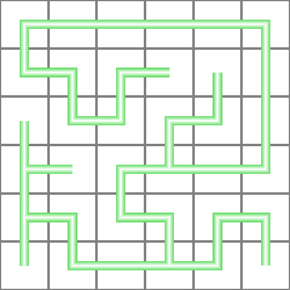

Skip to content
Search or jump to…
Pull requests
Issues
Marketplace
Explore
 
@GlooMyPan 
FettGoenner
/
coma3
Public
Code
Issues
Pull requests
Actions
Projects
Wiki
Security
Insights
coma3/README.md
@FettGoenner
FettGoenner better readme
Latest commit 9542acf 11 days ago
 History
 2 contributors
@FettGoenner@invalid-email-address
155 lines (122 sloc)  4.62 KB
   
# Netzwerkpuzzle Dokumentation

##### Inhalt
1. [Ziel des Spiels](#ziel)
2. [How To Play](#howto)
    1. [Beispiel](#beispiel)
3. [Benutzeroberfläche](#benutz)
    1. [Kontrollfeld](#kontroll)
    2. [Menüeinträge](#menu)
    3. [New-Game-Dialog](#newgame)
    4. [Tastenkürzel](#tast)
4. [Strategie-Tipp](#strat)

## Ziel des Spiels
Repariere das Netzwerk, indem du die Teile des Netzwerks drehst,
sodass sie an all ihren Enden verbunden sind.
Achte außerdem darauf, dass **genau ein** zusammenhängendes
Netzwerk entsteht.

*Sei schnell! Die Uhr tickt.*\
*Drehe Teile nicht unnötig! Der Zähler läuft.*

## How To Play 
Klicke mit der linken Maustaste auf ein Teil im Netzwerk,
um es im Uhrzeigersinn zu drehen.

### Beispiel
Puzzle \

Lösung \

## Benutzeroberfläche

### Kontrollfeld
`00:00` &nbsp; (Timer)
> Misst die verbrauchte Zeit.
`Steps: 0` &nbsp; (Zähler)
> Zählt die Anzahl der Drehungen.
`Pause`
> Pausiert den Timer und versteckt das Puzzle, wenn das Spiel läuft. \
> **Oder** \
> Setzt den Timer wieder in Gang und zeigt das Puzzle wieder an,
> wenn das Spiel pausiert ist.
`Solution`
> Löst das Spiel sofort für dich.
`Hint`
> Dreht ein Teil in falscher Position in korrekte Position.
> Aber sei sparsam! Du hast nur drei Hints.
---
`New Game`
> Öffnet den New-Game-Dialog, um ein neues Spiel zu 
> konfigurieren und zu starten.
`Reset Game`
> Setzt das Spiel auf Ausgangsposition und Timer und Zähler auf 0.

### Menüeinträge
`Game` &rarr; `New` &nbsp;&nbsp;(`Ctrl+N`)
> Öffnet den New-Game-Dialog, um ein neues Spiel zu 
> konfigurieren und zu starten.
`Game` &rarr; `Reset` &nbsp;&nbsp;(`Ctrl+R`)
> Setzt das Spiel auf Ausgangsposition und Timer und Zähler auf 0.
`Game` &rarr; `Pause` / `Resume` &nbsp;&nbsp;(`F9`)
> Pausiert den Timer und versteckt das Puzzle, wenn das Spiel läuft. \
> **Oder** \
> Setzt den Timer wieder in Gang und zeigt das Puzzle wieder an,
> wenn das Spiel pausiert ist.
`Game` &rarr; `Save` &nbsp;&nbsp;(`Ctrl+S`)
> Speichert den Spielstand.
`Game` &rarr; `Load` &nbsp;&nbsp;(`Ctrl+O`)
> Lädt einen Spielstand und startet ihn.
`Game` &rarr; `Exit` &nbsp;&nbsp;(`Ctrl+W`)
> Schließt das Spiel. :(
`Move` &rarr; `Solution` &nbsp;&nbsp;(`Alt+S`)
> Löst das Spiel sofort für dich.
`Move` &rarr; `Hint` &nbsp;&nbsp;(`Ctrl+H`)
> Dreht ein Teil in falscher Position in korrekte Position.
> Aber sei sparsam! Du hast nur drei Hints.
`Help` &rarr; `About` &nbsp;&nbsp;(`none`)
> Öffnet Informationen über Netzwerkpuzzle.
`Help` &rarr; `Help` &nbsp;&nbsp;(`none`)
> Öffnet diese Bedienungsanleitung für Netzwerkpuzzle.

### New-Game-Dialog
Der New-Game-Dialog konfiguriert und startet ein neues Spiel.

`Size`  bestimmt die Größe (Kantenlänge) des Puzzles. \
`Seed`  ist eine Zahl, die zu einem bestimmten Spiel gehört und
        genau dieses erzeugt, falls `Size` korrekt gewählt ist. \
`roll`  erzeugt neuen, zufälligen Seed. \
`Depth` /
`Prim`  sind zwei verschiedene Algorithmen zur Erzeugung
        des Puzzles. Siehst du den Unterschied? ;)

### Tastenkürzel

| Funktion                  | Kürzel |
|---------------------------|--------|
| New-Game-Dialog öffnen    |`Ctrl+N`|
| Spiel zurücksetzen        |`Ctrl+R`|
| Spiel pausieren           |`F9`    |
| Spiel fortsetzen          |`F9`    |
| Spiel speichern           |`Ctrl+S`|
| Spiel laden               |`Ctrl+O`|
| Spiel beenden/schließen   |`Ctrl+W`|
| Lösung zeigen             |`Alt+S` |
| Hint (Tipp) geben         |`Ctrl+H`|
| Informationen öffnen      |`none`  |
| Dokumentation öffnen      |`none`  |

## Strategie-Tipp
Um es dir leichter zu machen, kannst du folgende Strategie anwenden:

<u>**Schritt 1** </u> \
Kein Teil am Netzwerkrand darf zum Rand zeigen. Drehe deshalb alle
Rand- und Eckenteile zunächst so, dass das nicht mehr der Fall ist.
Hier haben alle Randteile nur eine mögliche Position. Sie betrachten
wir als **fest** (grün hinterlegt) und drehen sie nicht mehr.

<u>**Schritt 2** </u> \
Nun betrachten wir die Teile, die die Randteile berühren.
Drehe alle Teile davon so, dass sie mit den Randteilen korrekt
verbunden werden. Auch hier gibt es neue **feste** Teile:

<u>**Schritt 3** </u> \
Gehe weiter so vor, indem du dich immer näher zur Netzwerkmitte
arbeitest. Hier muss nur noch ein Teil gedreht werden.
© 2022 GitHub, Inc.
Terms
Privacy
Security
Status
Docs
Contact GitHub
Pricing
API
Training
Blog
About
