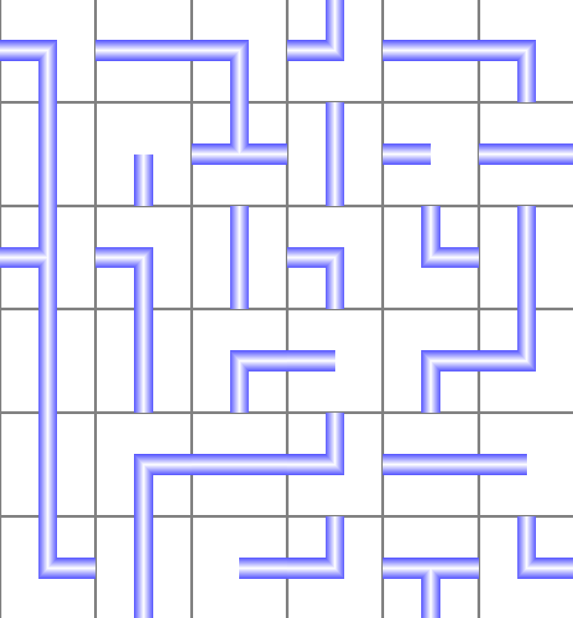
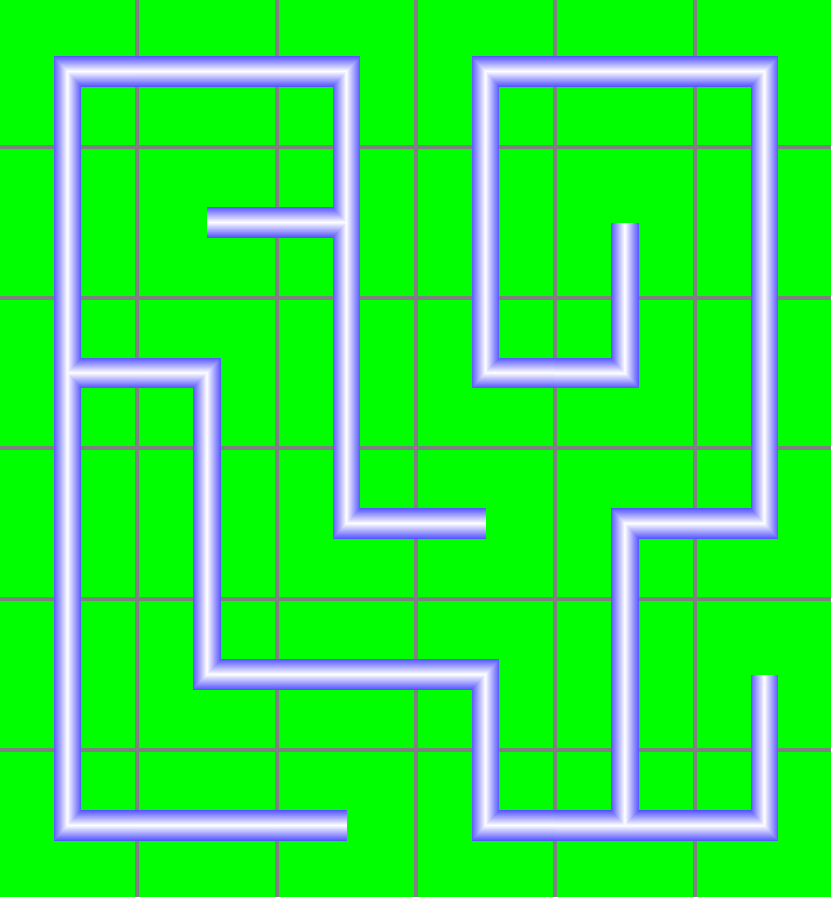
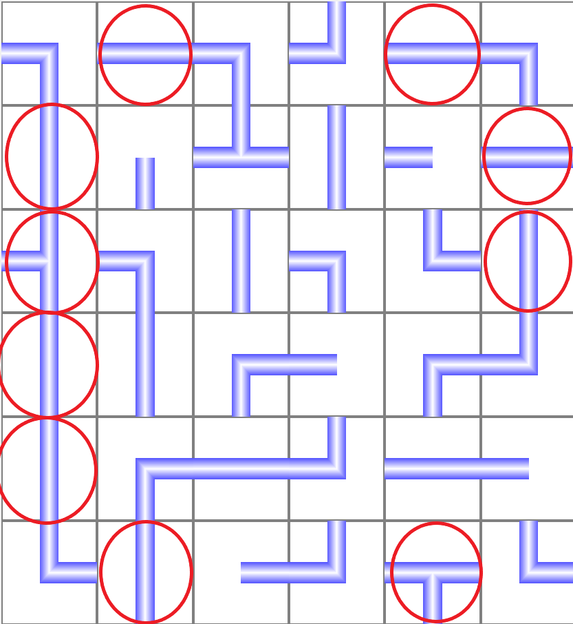
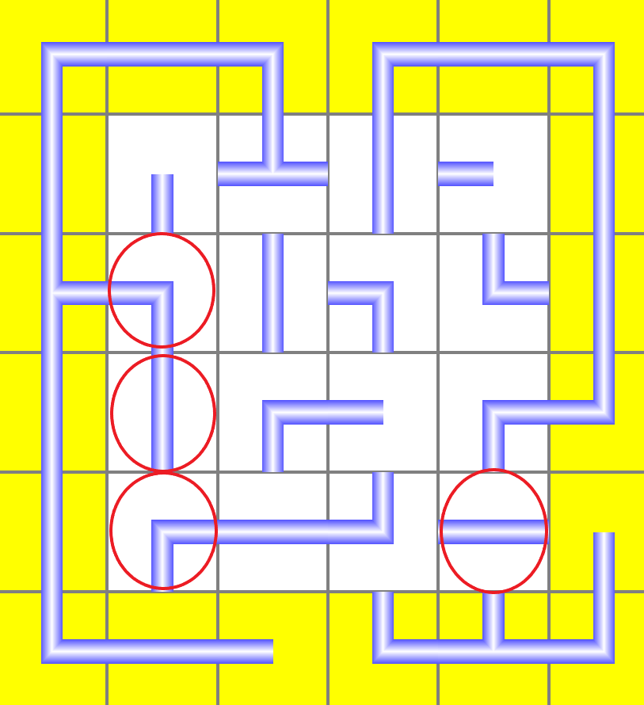
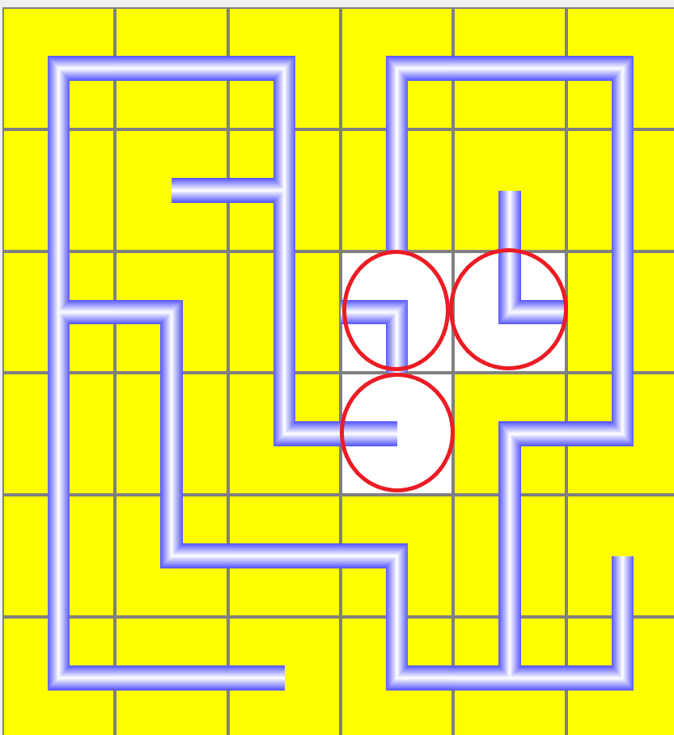

# Netzwerkpuzzle

## Ziel des Spiels
Repariere das Netzwerk, indem du die Teile des Netzwerks drehst,
sodass sie an all ihren Enden verbunden sind.
Achte außerdem darauf, dass **genau ein** zusammenhängendes
Netzwerk entsteht.

*Sei schnell! Die Uhr tickt.*\
*Drehe Teile nicht unnötig! Der Zähler läuft.*

## How To Play 
Klicke mit der linken Maustaste auf ein Teil im Netzwerk,
um es im Uhrzeigersinn zu drehen.

### Beispielproblem

### Beispiellösung

## Strategie
Um es dir leichter zu machen, kannst du folgende Strategie anwenden:

<u>**Schritt 1** </u> \
Kein Teil am Netzwerkrand darf zum Rand zeigen. Drehe deshalb alle
Rand- und Eckenteile zunächst so, dass das nicht mehr der Fall ist.

<u>**Schritt 2** </u> \
Nun betrachten wir die Teile, die die Randteile berühren.
Drehe alle Teile davon so, dass sie mit den Randteilen korrekt
verbunden werden.

<u>**Schritt 3** </u> \
Gehe weiter so vor, indem du dich immer näher zur Netzwerkmitte
arbeitest.
Du wirst eventuell trotzdem ein bisschen knobeln müssen.

